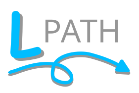

Linguistics Pathway Analysis of Trajectories using Hierarchical clustering
==============================
[//]: # (Badges)

A user-friendly, Python tool for clustering pathways from molecular dynamics and weighted ensemble simulations.

### Copyright

Copyright (c) 2023, Anthony Bogetti, Jeremy Leung, Lillian Chong

### TODO
- [x] EXTRACT step only does WE right now, need to extend to plain MD (i.e. a states.npy)
- [x] Usage.rst page
- [ ] example ipynbs are bare bones, need sample files
- [ ] unit testing
- [x] extract defaults to last frame of iteration. Implement stride and actually give pcoord/auxdata to correct frame.
- [x] command line interface/argparser
- [x] Sphinx/Read the Docs autodoc
- [x] Run each tool directly
- [ ] Rename Repo

#### Acknowledgements
 
Project based on the 
[Computational Molecular Science Python Cookiecutter](https://github.com/molssi/cookiecutter-cms) version 1.1.
